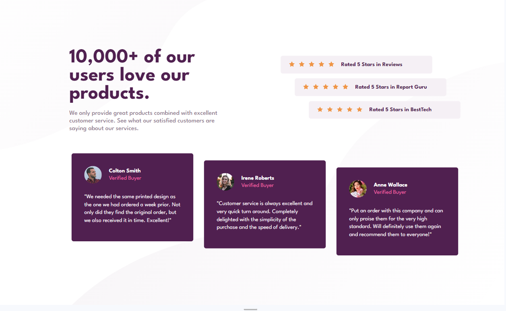
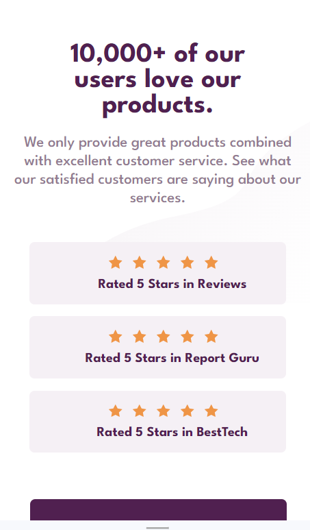
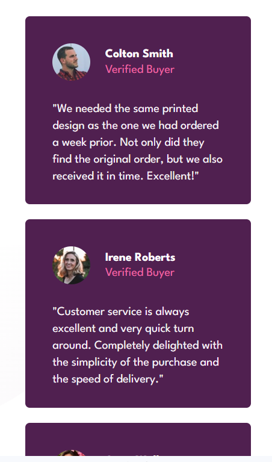

# Frontend Mentor - Social proof section solution

This is a solution to the [Social proof section challenge on Frontend Mentor](https://www.frontendmentor.io/challenges/social-proof-section-6e0qTv_bA). Frontend Mentor challenges help you improve your coding skills by building realistic projects. 

## Table of contents

- [Overview](#overview)
  - [The challenge](#the-challenge)
  - [Screenshot](#screenshot)
  - [Links](#links)
- [My process](#my-process)
  - [Built with](#built-with)
- [Author](#author)

## Overview

### The challenge

Users should be able to:

- View the optimal layout for the section depending on their device's screen size

### Screenshot

README-template
### Links

- Solution URL: [Solution](https://github.com/melissabo94/social-proof-section)
- Live Site URL: [Live Site](https://melissabo94.github.io/social-proof-section/)

## My process

### Built with

- Semantic HTML5 markup
- CSS custom properties
- Flexbox

## Author

- LinkedIn - [Melissa Borgnino](https://www.linkedin.com/in/melissa-borgnino-909712198/)
- Frontend Mentor - [@melissabo94](https://www.frontendmentor.io/profile/melissabo94)

